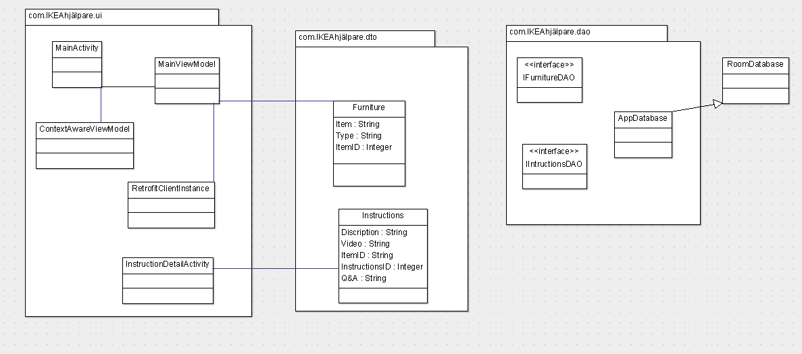

# IKEA-Hjalpare

## Class Diagram

### Class Diagram Description
**MainActivity:** This is the main page that the user will spend more time on. It is simple so that the user can just find what they need and get to building

**InstructionDetailsActivity:** This screen shows the video link to constructing the furniture along with its Q&A section

**RetrofitClientInstance:** Bootstrap class required for Retrofit.

**Furniture:** Noun class that represents the furniture.

**Intructions:** Noun class that represents Instructions.

**IFurnitureDAO:** Interface for Retrofit to find and parse Instructions JSON.

**IIntructionsDAO:** Interface for Room store Instructions data
